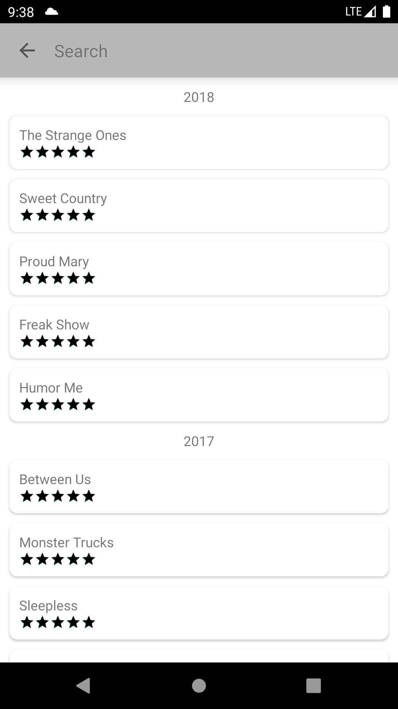

# A-Decade-of-Movies

    

## Implementation Details
The solution is implemented using most of the concepts of **[Clean Architecture](https://blog.cleancoder.com/uncle-bob/2012/08/13/the-clean-architecture.html)** and is divided in three layers i.e. Data, Domain and UI.
Following is a very basic structure of how the application implementation is distributed in different layers. You will see interactors in the diagram but won't find any in the application as the original thought I 
had while initiating the application was that the for such small projects interactors basically end up being one liner calls to repositories. And obviously more layers could have been made but seemed unnecessary
owing to the size of the project.

The domain layer contains all the abstractions/interfaces that can help you navigate through the project better if you are unfamiliar with this project structure.

Following are the features implemented;
1. The user can view the list of, search for and view details of all the movies in the application.
2. The movie data is persisted in **Room Database**. And **RxJava** is used to fetch the data through repositories.  
3. All the project dependencies are injected using **Dagger2**
4. **Dark Theme** support for Android 10 and above
5. **Master Detail Flow** for screen wider than 600dp in portrait and 960dp in landscape.
6. The data for photos is fetched from [Flickr API](https://www.flickr.com/) using **Retrofit2**
7. The project also contains basic **Unit tests** implemented using **JUnit4, Androidx tests and Mockito**.

## Somethings that could have been done better
1. The data could have been paginated.
2. A Data store repository should have been implemented in the data layer for local and remote data for better design and ease while testing.
3. The implementation of restricting the search results to maximum 5 per year and year categorization could have been done in the interactors. Right now it is in MovieSearchListMapper class.
4. I would have liked to spend more time on tests as the amount of tests written is a little low.

## Project Setup
1. Clone the project and run it in Android studio.
2. Go to Flickr developer page and generate an API key.
3. Copy the generated API key from your account details page.
4. Store the copied API key in your computers Environment Variables by name: __FlickrApiKey__
5. You will also have to store the API base url in your computers Environment Variables by name: __FlickrApiBaseUrl__
6. Or you can just uncomment the url I have commented in the configs.gradle file and also hard code the Api key there if the project will live and die in your system. 
5. Build and Run the application \m/.